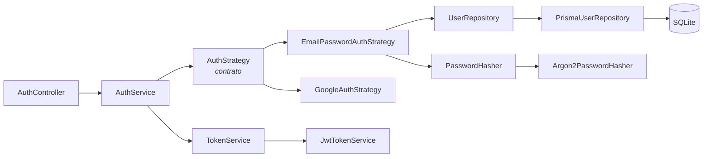

# Authentication POC — NestJS + SOLID + Strategy Pattern

POC de autenticação construída para estudar SOLID e o Strategy Pattern em um
backend real: dois mecanismos de login (e-mail/senha e Google), cada um isolado
atrás do mesmo contrato, testáveis sem banco e sem framework.

O critério de sucesso não é "o login funciona" — é **adicionar o segundo
provedor sem alterar o primeiro**.

---

## Stack

| Responsabilidade | Tecnologia |
| ---------------- | ---------- |
| Backend | NestJS 11 |
| Linguagem | TypeScript 5 |
| Banco | SQLite |
| ORM | Prisma 6 |
| Auth framework | Passport |
| Login local | passport-local |
| Proteção da API | passport-jwt |
| Token | @nestjs/jwt |
| Senhas | argon2 (argon2id) |
| Validação | class-validator + class-transformer |
| Documentação | OpenAPI 3 / Swagger UI |
| Testes | Jest + Supertest |

---

## Instalação do zero

Requisitos: **Node.js 20+** e npm.

```bash
# 1. dependências
npm install

# 2. variáveis de ambiente
cp .env.example .env        # Windows: copy .env.example .env

# 3. gere um JWT_SECRET e cole no .env
node -e "console.log(require('crypto').randomBytes(48).toString('hex'))"

# 4. banco de dados
npm run db:migrate

# 5. usuário de desenvolvimento
npm run db:seed

# 6. suba a API
npm run start:dev
```

A API responde em `http://localhost:3000` e a documentação interativa em
`http://localhost:3000/docs`.

### Credenciais de teste

```
demo@example.com
Demo@123
```

---

## Experimentando

```bash
# login
curl -X POST http://localhost:3000/auth/login \
  -H "Content-Type: application/json" \
  -d '{"email":"demo@example.com","password":"Demo@123"}'

# rota protegida
curl http://localhost:3000/auth/me \
  -H "Authorization: Bearer <accessToken>"

# logout
curl -X POST http://localhost:3000/auth/logout \
  -H "Authorization: Bearer <accessToken>"
```

---

## Endpoints

| Método | Endpoint | Auth | Finalidade |
| ------ | -------- | ---- | ---------- |
| `POST` | `/auth/login` | — | Login por e-mail e senha |
| `GET` | `/auth/me` | JWT | Usuário autenticado |
| `POST` | `/auth/logout` | JWT | Encerrar sessão lógica |
| `GET` | `/auth/google` | — | Iniciar OAuth do Google |
| `GET` | `/auth/google/callback` | — | Callback do OAuth |
| `GET` | `/docs` | — | Swagger UI |

O contrato completo está em
[`docs/swagger/api.swagger.yaml`](docs/swagger/api.swagger.yaml).

### Habilitando o login com Google

As rotas do Google existem sempre, mas respondem `503` até que as credenciais
sejam configuradas. Para habilitá-las, preencha no `.env`:

```env
GOOGLE_CLIENT_ID="..."
GOOGLE_CLIENT_SECRET="..."
GOOGLE_CALLBACK_URL="http://localhost:3000/auth/google/callback"
```

As credenciais saem do [Google Cloud Console](https://console.cloud.google.com/apis/credentials)
(OAuth 2.0 Client ID, tipo *Web application*), com a callback URL acima
registrada como *Authorized redirect URI*.

---

## A ideia central



O controller não decide o provedor. Não existe `if (provider === 'google')` em
lugar nenhum: as Strategies são registradas em um array e consultadas por um
`Map`. Adicionar um terceiro provedor é criar uma classe e acrescentar uma
linha.

Detalhes em [`docs/architecture.md`](docs/architecture.md) e
[`docs/solid.md`](docs/solid.md).

---

## Scripts

```bash
npm run start:dev        # desenvolvimento com watch
npm run build            # compila para dist/
npm run start:prod       # roda o build

npm run lint             # ESLint com --fix
npm run lint:check       # ESLint sem alterar arquivos
npm run format           # Prettier

npm run test             # unitários + integração
npm run test:unit
npm run test:integration
npm run test:e2e
npm run test:cov         # cobertura
npm run test:watch

npm run docs:lint        # valida o OpenAPI

npm run db:migrate       # migration em desenvolvimento
npm run db:seed          # usuário de desenvolvimento
npm run db:studio        # Prisma Studio
npm run db:reset         # recria o banco do zero
```

---

## Documentação

| Documento | Conteúdo |
| --------- | -------- |
| [docs/README.md](docs/README.md) | Índice e por que o Swagger é um arquivo |
| [docs/architecture.md](docs/architecture.md) | Camadas, dependências, papel do Passport e do Prisma |
| [docs/solid.md](docs/solid.md) | Cada princípio apontando para arquivos reais |
| [docs/authentication-flow.md](docs/authentication-flow.md) | Login, JWT, Google, logout |
| [docs/database.md](docs/database.md) | Schema, migrations, seed |
| [docs/testing.md](docs/testing.md) | Pirâmide, mocks, cobertura |

---

## Limitações conscientes

Este POC é pequeno de propósito. O que ficou de fora, e por quê:

| Fora do escopo | Motivo |
| -------------- | ------ |
| Refresh token | Duplicaria a superfície sem ilustrar nada novo de SOLID |
| Revogação de token no logout | Exigiria blacklist/Redis; a limitação está documentada e testada |
| RBAC / permissões | Assunto de autorização, não de autenticação |
| Cadastro, recuperação de senha, confirmação de e-mail | O seed cobre a necessidade de testar login |
| Redis, filas, Docker obrigatório, microserviços | Infraestrutura sem contrapartida didática |

O logout merece destaque: ele responde `204` e **não invalida o token**. O
cliente deve descartá-lo. Há um teste E2E que documenta esse comportamento
para que ninguém o encontre achando que é bug — ver
[docs/authentication-flow.md](docs/authentication-flow.md#logout).

---

## Extensões recomendadas no VS Code

| Extensão | Para quê |
| -------- | -------- |
| **Prisma** (oficial) | Highlight e autocomplete no `schema.prisma` |
| **SQLite Viewer** | Abrir `prisma/dev.db` direto no editor |
| **Markdown Preview Mermaid Support** (Matt Bierner) | Ver os diagramas dos `.md` (`Ctrl+Shift+V`) |
| **Markdown All in One** | Índice, listas e atalhos nos `.md` |
| **YAML** (Red Hat) | Editar `api.swagger.yaml` com validação |
| **ESLint** + **Prettier** | Lint e formatação automáticos |

---

## Licença

MIT.
