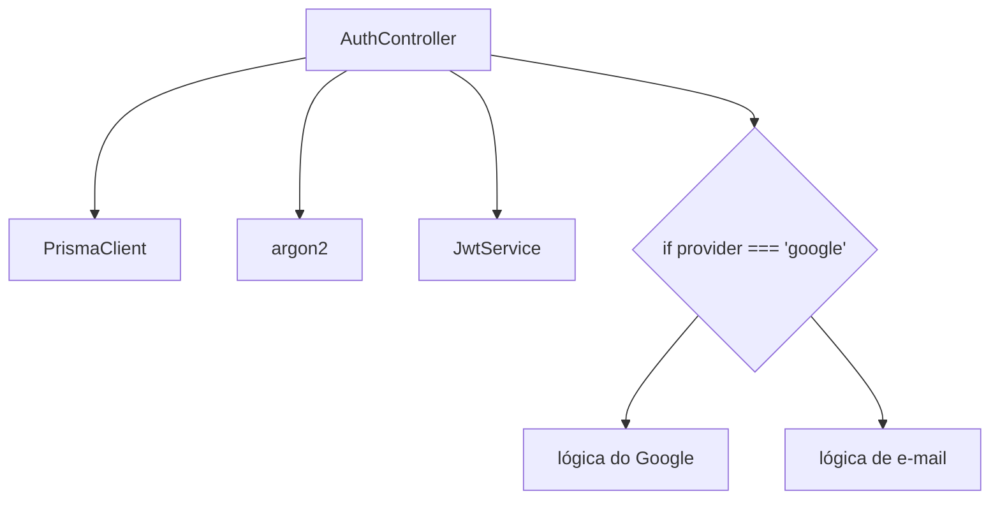
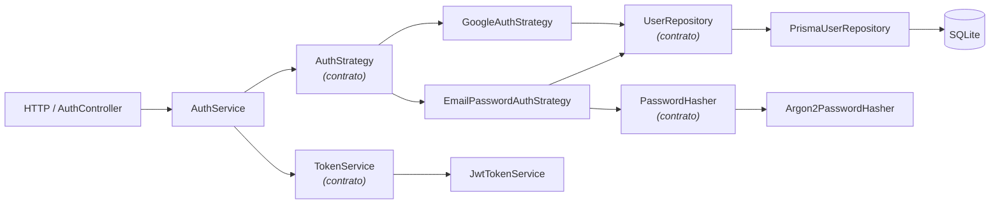
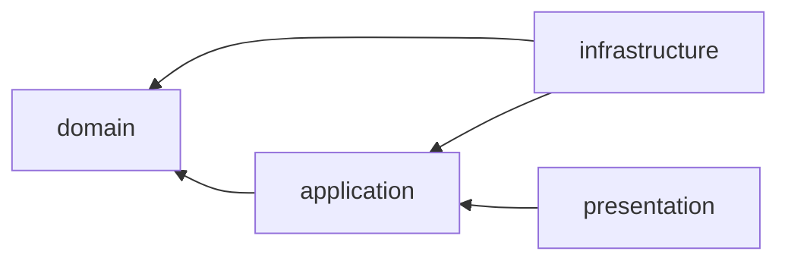

# Arquitetura

## Objetivo

Autenticar usuários por mais de um mecanismo, mantendo cada mecanismo isolado,
substituível e testável sem banco, sem rede e sem framework.

O critério de sucesso não é "o login funciona" — isso um controller de 30 linhas
resolve. O critério é: **adicionar o segundo provedor não deve exigir alterar o
primeiro**.

## O que estamos evitando

A versão ingênua concentra tudo na borda:



Três problemas: o controller sabe demais; cada novo provedor engorda o `if`; e
não há como testar a regra sem subir HTTP e banco.

## O desenho adotado



O núcleo conhece apenas contratos:

```
AuthStrategy · UserRepository · PasswordHasher · TokenService
```

E nunca conhece os detalhes:

```
PrismaClient · argon2 · JwtService · Passport · SQLite
```

## Camadas

O material da aula usa `Presentation / Domain / Data`. Aqui usamos quatro
nomes, o que **não** é uma mudança de princípio — é só a divisão natural de um
backend:

| Camada | Papel | Pode depender de |
| ------ | ----- | ---------------- |
| `presentation/` | Traduz HTTP em chamadas de caso de uso | `application`, `domain` |
| `application/` | Casos de uso e regras de autenticação | `domain` |
| `domain/` | Entidades e contratos. Sem dependências. | nada |
| `infrastructure/` | Detalhes concretos: Prisma, Argon2, JWT, Passport | `domain`, `application` |

`infrastructure` corresponde ao que o material chama de borda/`Data`. A camada
`application` só deixa os casos de uso explícitos.

**A regra que sustenta tudo:** as setas de dependência apontam para dentro.
Detalhes conhecem contratos; contratos não conhecem detalhes.



## Estrutura de pastas

```
src/
├── main.ts                        bootstrap: pipes, filtros, Swagger
├── app.module.ts
├── swagger.ts                     serve o api.swagger.yaml em /docs
│
├── config/                        configuração tipada + validação de env
│
├── modules/
│   ├── auth/
│   │   ├── domain/
│   │   │   ├── entities/auth-session.ts       AuthIdentity, AuthSession
│   │   │   └── contracts/
│   │   │       ├── auth-strategy.ts           ← a abstração central
│   │   │       ├── password-hasher.ts
│   │   │       └── token-service.ts
│   │   ├── application/
│   │   │   ├── auth.service.ts                orquestra o caso de uso
│   │   │   └── strategies/
│   │   │       ├── email-password-auth.strategy.ts
│   │   │       └── google-auth.strategy.ts
│   │   ├── presentation/
│   │   │   ├── auth.controller.ts
│   │   │   ├── current-user.decorator.ts
│   │   │   └── dto/login.dto.ts
│   │   └── infrastructure/
│   │       ├── auth.module.ts                 ← onde contrato encontra detalhe
│   │       ├── passport/                      adaptadores do Passport
│   │       ├── guards/
│   │       └── security/                      Argon2, JWT
│   │
│   └── users/
│       ├── domain/
│       │   ├── entities/user.ts
│       │   └── contracts/user.repository.ts
│       ├── infrastructure/prisma-user.repository.ts
│       └── users.module.ts
│
├── database/                      PrismaService e PrismaModule
└── shared/errors/                 erros de aplicação + filtro HTTP
```

## O papel do Passport

Existem **duas** coisas chamadas "strategy" neste projeto, e confundi-las
desmonta o exercício inteiro:

| | `AuthStrategy` (domínio) | `PassportStrategy` (infraestrutura) |
| - | ------------------------ | ----------------------------------- |
| Onde | `application/strategies/` | `infrastructure/passport/` |
| Responde | "quem é este usuário?" | "como extrair credenciais da request?" |
| Exemplos | `EmailPasswordAuthStrategy`, `GoogleAuthStrategy` | `LocalPassportStrategy`, `JwtPassportStrategy`, `GooglePassportStrategy` |
| Testável | com fakes, sem framework | precisa do Passport |

O Passport é um **adaptador**. `LocalPassportStrategy` não decide nada: extrai
`email` e `password` da requisição e chama `AuthService`. Se o Passport fosse
removido amanhã, as regras continuariam existindo.

## O papel do Prisma

`PrismaUserRepository` é o único arquivo do módulo de usuários que importa
`@prisma/client`. Seu método privado `toDomain()` é a fronteira: dali para
dentro, o sistema só conhece a entidade `User` do domínio.

Isso não é cerimônia. Se o resto do código usasse o tipo gerado pelo Prisma,
toda regra de negócio passaria a depender do ORM.

## Como o provedor é escolhido sem `if/else`

Esta é a pergunta central do exercício. A resposta está em
[`auth.module.ts`](../src/modules/auth/infrastructure/auth.module.ts):

```ts
const authStrategiesProvider: Provider = {
  provide: AUTH_STRATEGIES,
  useFactory: (email, google) => [email, google],
  inject: [EmailPasswordAuthStrategy, GoogleAuthStrategy],
};
```

O `AuthService` recebe esse array e monta um `Map<AuthProvider, AuthStrategy>`
no construtor. Escolher a Strategy vira uma consulta:

```ts
const strategy = this.registry.get(provider);
```

Registrar um terceiro provedor amanhã = criar uma classe e acrescentar uma
linha ao array. `AuthService`, `AuthController` e as Strategies existentes não
mudam.

## Tratamento de erros

O núcleo lança erros de aplicação (`InvalidCredentialsError`,
`AuthenticationProviderError`, `UnsupportedAuthProviderError`), que não sabem o
que é HTTP. `ApplicationErrorFilter`, registrado no `main.ts`, é o único ponto
que traduz:

| Erro do núcleo | HTTP |
| -------------- | ---- |
| `InvalidCredentialsError` | 401 |
| `AuthenticationProviderError` | 502 |
| `UnsupportedAuthProviderError` | 400 |
| qualquer outro `ApplicationError` | 500 |

## Decisões conscientes

| Decisão | Motivo |
| ------- | ------ |
| Sem refresh token | Escopo. Ver [authentication-flow.md](authentication-flow.md). |
| Logout sem blacklist | Exigiria estado distribuído sem ganho didático. |
| `passwordHash` opcional | Usuário criado só via Google não tem senha local. |
| Swagger em arquivo único | Ver [README.md](README.md). |
| Sem cadastro de usuário | O seed cobre a necessidade de testar login. |
| SQLite | Zero configuração; o repositório esconde a escolha. |
