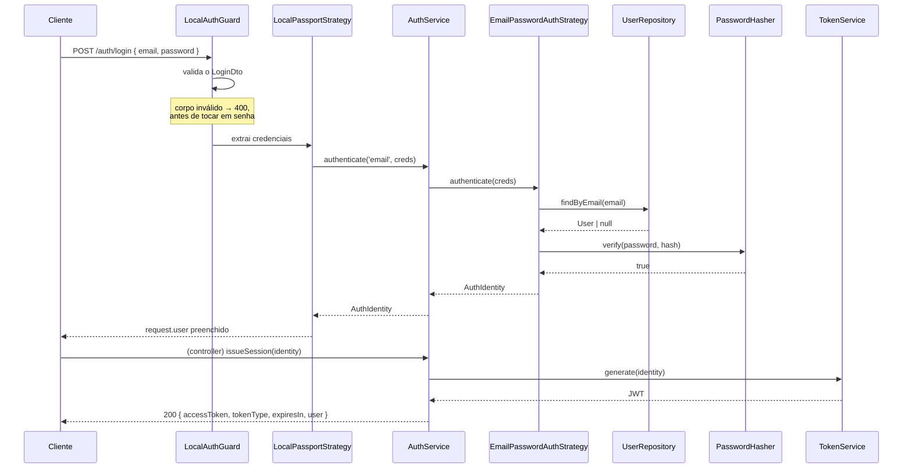
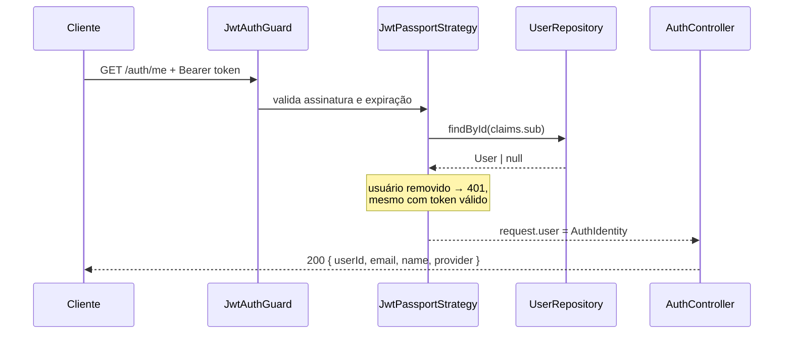
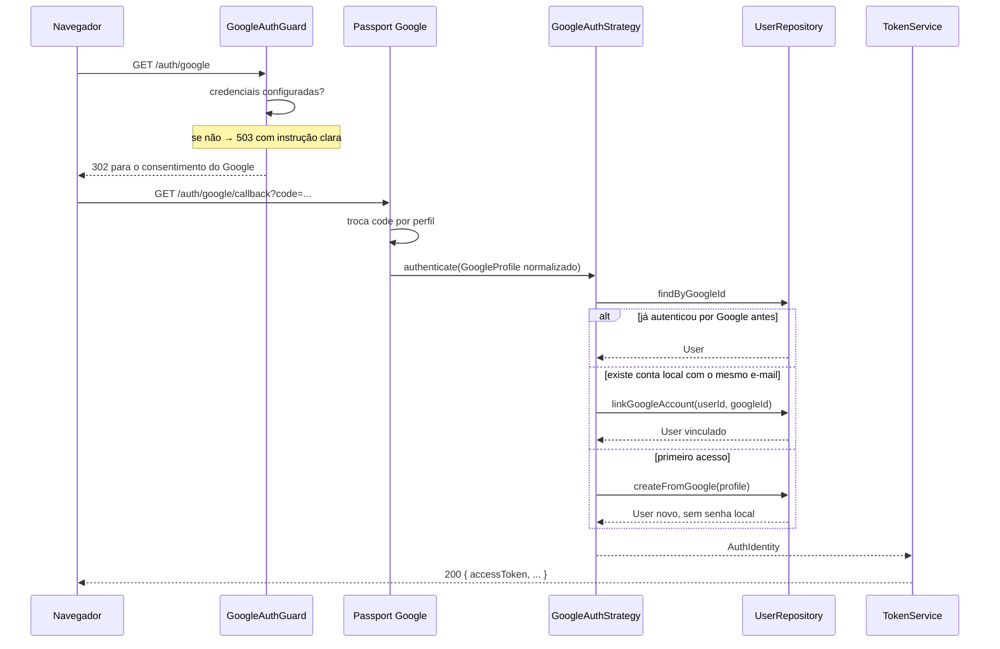

# Fluxos de autenticação

## Login por e-mail e senha



### Por que o guard valida o DTO

No NestJS, **guards rodam antes dos pipes**. Sem a validação dentro de
[`LocalAuthGuard`](../src/modules/auth/infrastructure/guards/local-auth.guard.ts),
um corpo malformado seria rejeitado pelo Passport como `401`, quando o correto
é `400`: o cliente errou a requisição, não a senha.

| Situação | Status |
| -------- | ------ |
| corpo ausente, e-mail inválido, senha curta, campo desconhecido | `400` |
| e-mail não cadastrado | `401` |
| senha incorreta | `401` |
| usuário existe mas só tem conta Google | `401` |

### Por que a mensagem de erro é sempre a mesma

`InvalidCredentialsError` é lançado com o mesmo texto para "usuário não existe"
e "senha errada". Mensagens diferentes permitiriam descobrir quais e-mails
estão cadastrados, um por um.

> **Limite conhecido.** A resposta é idêntica, mas o *tempo* de resposta não:
> quando o usuário existe, o Argon2 roda; quando não existe, retornamos antes.
> Um atacante paciente consegue medir isso. Mitigar exigiria verificar um hash
> descartável no caminho de "usuário inexistente". Ficou de fora do escopo, mas
> a limitação é real e está registrada aqui.

---

## Rota protegida — `GET /auth/me`



A consulta ao repositório é deliberada. Um JWT continua criptograficamente
válido depois que o usuário some do banco; sem essa checagem, o token ainda
abriria a rota.

---

## Login com Google



### Adaptação consciente em relação ao material da aula

No exemplo do professor o cliente é Flutter, e o Google Sign-In basta: não há
necessidade de um `TokenManager` próprio.

Aqui o contexto é diferente. Quem precisa ser protegido são os endpoints
**desta API**, então o backend emite o próprio JWT após confirmar a identidade
no Google. O token do Google autentica *quem é a pessoa*; o JWT da API autoriza
*o acesso a esta API*.

### Três caminhos, uma decisão de produto

O `else if` dentro de `GoogleAuthStrategy` não é o `if/else` que a arquitetura
proíbe. Aquele seria sobre **qual provedor usar**; este é sobre **o estado da
conta**, e vive dentro da Strategy a que pertence.

Vincular por e-mail (caminho 2) é uma escolha: assume-se que o Google verificou
o endereço. Se essa premissa não valesse, o vínculo automático permitiria tomar
contas alheias.

---

## JWT

Payload no fio:

```json
{
  "sub": "clx0000000000000000000000",
  "email": "demo@example.com",
  "provider": "email",
  "iat": 1767225600,
  "exp": 1767229200
}
```

A tradução entre `sub` (JWT) e `subject` (aplicação) acontece dentro de
[`JwtTokenService`](../src/modules/auth/infrastructure/security/jwt-token.service.ts),
e só ali. O contrato `TokenService` não menciona a palavra "JWT" de propósito:
JWT é a implementação escolhida, não o contrato.

Configuração:

```env
JWT_SECRET=...
JWT_EXPIRES_IN=1h
```

**Sem refresh token neste POC.** Quando o access token expira, é preciso fazer
login de novo.

---

## Logout

```
POST /auth/logout  →  204 No Content
```

O endpoint exige autenticação e **não faz nada no servidor**.

> **Limitação intencional, e é importante saber explicá-la.**
> O JWT é stateless. Não há blacklist, não há revogação. Depois do logout, o
> token continua criptograficamente válido até `exp`. O contrato real é:
> *o cliente deve descartar o access token*.
>
> Há um teste E2E que documenta esse comportamento explicitamente —
> `'o token CONTINUA valido depois do logout'` — para que ninguém o descubra
> como se fosse um bug.

Revogação de verdade exigiria uma destas rotas, todas fora do escopo:

| Abordagem | Custo |
| --------- | ----- |
| Blacklist de tokens | armazenamento compartilhado (Redis) e consulta a cada request |
| Sessões no banco | o token deixa de ser stateless; consulta a cada request |
| Access curto + refresh | dois tokens, rotação, endpoint novo, mais superfície |

Para um POC cujo objetivo é demonstrar SOLID no ponto de extensão da
autenticação, qualquer uma delas adicionaria infraestrutura sem adicionar
clareza.
