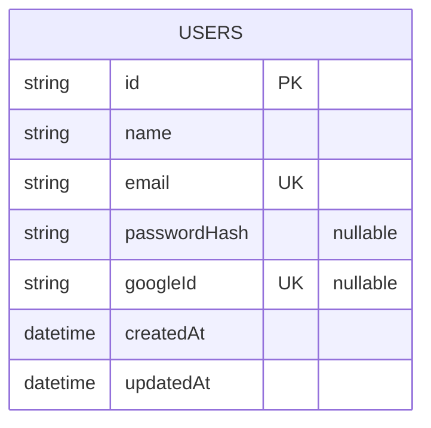

# Banco de dados

## Escolha

SQLite via Prisma. Zero configuração, zero servidor, o banco é um arquivo — o
que importa para um POC onde a persistência não é o assunto.

E, do ponto de vista do resto do sistema, a escolha é invisível: só
`PrismaUserRepository` sabe que existe SQLite. Trocar por PostgreSQL mudaria o
`provider` do schema e nada mais no código de regra.

## Modelo

```prisma
model User {
  id           String   @id @default(cuid())
  name         String
  email        String   @unique
  passwordHash String?
  googleId     String?  @unique
  createdAt    DateTime @default(now())
  updatedAt    DateTime @updatedAt

  @@map("users")
}
```



### Por que os dois campos são opcionais

| Campo | Nulo quando | Cenário |
| ----- | ----------- | ------- |
| `passwordHash` | usuário só existe via Google | login com Google no primeiro acesso |
| `googleId` | usuário nunca usou Google | conta local criada pelo seed |

Um usuário pode ter os dois preenchidos: é o caso de quem tinha conta local e
depois entrou com Google usando o mesmo e-mail — `GoogleAuthStrategy` vincula
as contas em vez de duplicar.

`EmailPasswordAuthStrategy` trata `passwordHash === null` como credencial
inválida: sem senha cadastrada, não há login local possível.

### O que deliberadamente não existe

`sessions`, `refresh_tokens`, `roles`, `permissions`, `providers`,
`oauth_accounts`.

Todas seriam justificáveis em produção. Nenhuma acrescenta nada ao ponto do
exercício, e cada uma acrescentaria código para manter.

> Uma tabela `oauth_accounts` separada seria o modelo correto para suportar
> muitos provedores por usuário. Com dois provedores e um `googleId`, a coluna
> resolve. Registrado aqui porque é o primeiro lugar onde este schema deixaria
> de servir.

## Comandos

```bash
npm run db:migrate    # cria/aplica migration em desenvolvimento
npm run db:deploy     # aplica migrations existentes (produção/CI)
npm run db:generate   # regenera o Prisma Client
npm run db:seed       # cria o usuário de desenvolvimento
npm run db:studio     # abre o Prisma Studio no navegador
npm run db:reset      # apaga tudo, reaplica migrations e roda o seed
```

## Seed

[`prisma/seed.ts`](../prisma/seed.ts) cria um usuário para exercitar o login:

```
demo@example.com
Demo@123
```

A senha é gravada **somente** depois de passar pelo Argon2 — o seed usa o mesmo
algoritmo que a aplicação.

O seed usa `upsert`: rodar duas vezes não duplica nem quebra.

Ele existe para eliminar a necessidade de implementar um fluxo de cadastro só
para conseguir testar autenticação.

## Ambientes

| Ambiente | Arquivo de env | Banco |
| -------- | -------------- | ----- |
| desenvolvimento | `.env` | `prisma/dev.db` |
| teste | `.env.test` | `prisma/test.db` |

Os arquivos `*.db` estão no `.gitignore`. O banco é recriável a partir das
migrations e do seed — não é artefato de código.

## Como inspecionar o banco

**Prisma Studio** (recomendado, já incluso):

```bash
npm run db:studio
```

**No VS Code:** a extensão **SQLite Viewer** abre `prisma/dev.db` com um clique.
Para executar queries, a extensão **SQLite** (alexcvzz) é a alternativa.
