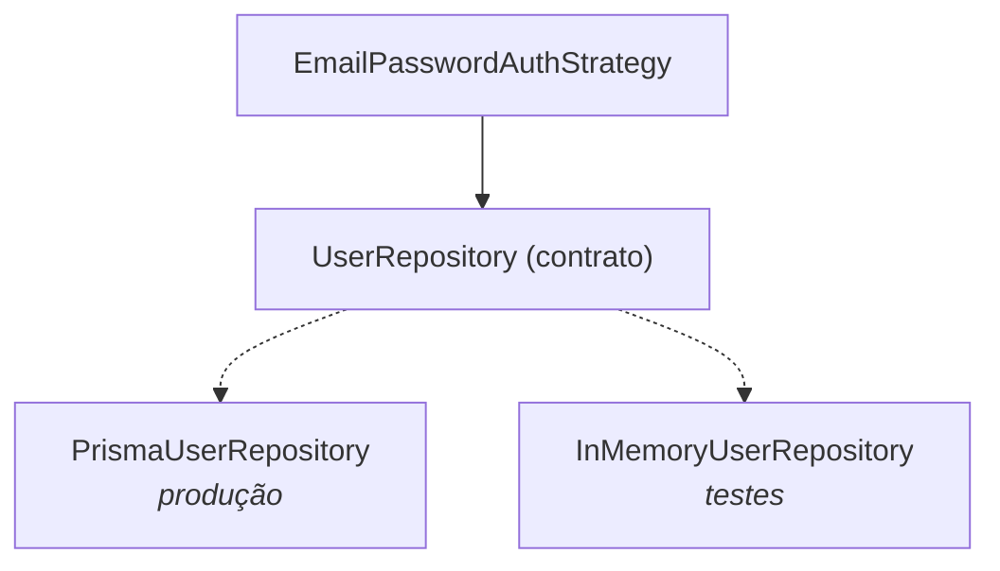

# SOLID neste projeto

Cada princípio abaixo aponta para **arquivos reais** deste repositório. Onde há
uma decisão discutível, ela está registrada — SOLID aplicado sem critério vira
cerimônia, e isso também é um erro.

---

## S — Single Responsibility

> Uma classe deve ter uma única razão para mudar.

| Classe | Única responsabilidade | Muda quando… |
| ------ | ---------------------- | ------------ |
| [`AuthController`](../src/modules/auth/presentation/auth.controller.ts) | Traduzir HTTP em casos de uso | a API HTTP muda |
| [`AuthService`](../src/modules/auth/application/auth.service.ts) | Orquestrar autenticação + emissão de sessão | o fluxo do caso de uso muda |
| [`EmailPasswordAuthStrategy`](../src/modules/auth/application/strategies/email-password-auth.strategy.ts) | Autenticar por e-mail e senha | a regra do login local muda |
| [`GoogleAuthStrategy`](../src/modules/auth/application/strategies/google-auth.strategy.ts) | Autenticar por Google | a regra de vínculo de conta muda |
| [`Argon2PasswordHasher`](../src/modules/auth/infrastructure/security/argon2-password-hasher.ts) | Hash e verificação de senha | trocamos o algoritmo |
| [`JwtTokenService`](../src/modules/auth/infrastructure/security/jwt-token.service.ts) | Emitir e ler tokens | trocamos o formato do token |
| [`PrismaUserRepository`](../src/modules/users/infrastructure/prisma-user.repository.ts) | Persistir usuários | trocamos o banco/ORM |
| [`ApplicationErrorFilter`](../src/shared/errors/application-error.filter.ts) | Mapear erro de domínio para status HTTP | o contrato HTTP de erros muda |

**Teste rápido:** trocar Argon2 por bcrypt toca **um** arquivo. Se tocasse o
controller e a Strategy, o princípio estaria violado.

---

## O — Open/Closed

> Aberto para extensão, fechado para modificação.

Este é o princípio que o projeto demonstra de forma mais literal, e é a razão de
existir uma segunda Strategy.

Antes:

```
AuthStrategy
     ↑
EmailPasswordAuthStrategy
```

Depois:

```
AuthStrategy
     ↑
     ├── EmailPasswordAuthStrategy
     └── GoogleAuthStrategy
```

Para adicionar o Google **não foi alterada nenhuma linha** de:

- `AuthController`
- `AuthService`
- `EmailPasswordAuthStrategy`
- `JwtTokenService`
- `Argon2PasswordHasher`
- `PrismaUserRepository`

O que mudou: uma classe nova, uma linha no array `AUTH_STRATEGIES` de
[`auth.module.ts`](../src/modules/auth/infrastructure/auth.module.ts), e
métodos novos no `UserRepository` (`findByGoogleId`, `createFromGoogle`,
`linkGoogleAccount`) — extensão do contrato de persistência, não alteração das
regras existentes.

> **Sinal de alerta.** Se algum dia for preciso abrir o `AuthService` e
> escrever `if (provider === 'google')`, a arquitetura terá falhado no que se
> propôs. A escolha da Strategy é uma consulta a um `Map`, não um condicional.

---

## L — Liskov Substitution

> Um subtipo deve poder substituir seu tipo base sem quebrar o programa.

Onde isso pega de verdade: o `AuthService` chama `strategy.authenticate(input)`
sem saber qual implementação está segurando. Para que isso seja seguro, o
contrato de comportamento — documentado em
[`auth-strategy.ts`](../src/modules/auth/domain/contracts/auth-strategy.ts) —
precisa valer para **todas**:

| Situação | Toda `AuthStrategy` deve… |
| -------- | ------------------------- |
| sucesso | retornar uma `AuthIdentity` completa |
| credencial inválida | lançar `InvalidCredentialsError` |
| falha do provedor | lançar `AuthenticationProviderError` |

O que quebraria Liskov:

```ts
// ❌ jamais
authenticate(): Promise<AuthIdentity> {
  throw new Error('essa Strategy não suporta authenticate');
}
```

Uma implementação que recusa um método obrigatório força quem chama a saber
qual implementação está em uso — exatamente o acoplamento que o contrato
existe para evitar.

Verificado em [`auth.service.spec.ts`](../test/unit/auth.service.spec.ts): a
`StubStrategy` dos testes é uma terceira implementação, criada só para o teste,
e o `AuthService` funciona com ela sem nenhuma adaptação.

---

## I — Interface Segregation

> Nenhum cliente deve depender de métodos que não usa.

O contrato gordo que **não** foi escrito:

```ts
// ❌ tudo em um lugar só
interface AuthStrategy {
  authenticate();
  generateJwt();
  hashPassword();
  saveUser();
  logout();
}
```

Com ele, `GoogleAuthStrategy` seria obrigada a implementar `hashPassword()` —
que não faz sentido para OAuth. O resultado seria um método vazio ou um
`throw`, e aí Liskov cairia junto.

O que foi escrito, quatro contratos pequenos e independentes:

| Contrato | Métodos | Quem depende |
| -------- | ------- | ------------ |
| [`AuthStrategy`](../src/modules/auth/domain/contracts/auth-strategy.ts) | `authenticate` | `AuthService` |
| [`PasswordHasher`](../src/modules/auth/domain/contracts/password-hasher.ts) | `hash`, `verify` | só a Strategy de e-mail |
| [`TokenService`](../src/modules/auth/domain/contracts/token-service.ts) | `generate`, `verify`, `expiresIn` | `AuthService` |
| [`UserRepository`](../src/modules/users/domain/contracts/user.repository.ts) | 5 buscas/escritas | ambas as Strategies |

Repare que `GoogleAuthStrategy` **não conhece** `PasswordHasher`: ela não
depende de nada que não usa.

> **Autocrítica honesta.** `UserRepository` é o maior dos contratos, com cinco
> métodos, e `findByGoogleId`/`createFromGoogle`/`linkGoogleAccount` só
> interessam à Strategy do Google. Segregar em `UserReader` + `GoogleUserWriter`
> seria mais puro. Não foi feito porque, com dois provedores, a indireção extra
> custaria mais clareza do que entregaria. É um bom exemplo de que o princípio
> tem um ponto de aplicação, não é um absoluto.

---

## D — Dependency Inversion

> Módulos de alto nível não devem depender de módulos de baixo nível. Ambos
> devem depender de abstrações.

O que **não** existe no código:

```ts
// ❌ regra de negócio amarrada ao ORM
class EmailPasswordAuthStrategy {
  constructor(private prisma: PrismaService) {}
}
```

O que existe:

```ts
// ✅ regra de negócio amarrada ao contrato
constructor(
  @Inject(USER_REPOSITORY) private readonly users: UserRepository,
  @Inject(PASSWORD_HASHER) private readonly hasher: PasswordHasher,
) {}
```

### Por que existem tokens `Symbol`

Interfaces do TypeScript desaparecem na compilação — não sobra nada em runtime
para o container do Nest usar como chave. Os tokens
(`USER_REPOSITORY`, `PASSWORD_HASHER`, `TOKEN_SERVICE`, `AUTH_STRATEGIES`)
resolvem isso e permitem continuar dependendo da abstração.

### Onde a inversão é amarrada

Em um único lugar, os módulos:

```ts
// users.module.ts
{ provide: USER_REPOSITORY, useClass: PrismaUserRepository }

// auth.module.ts
{ provide: PASSWORD_HASHER, useClass: Argon2PasswordHasher }
{ provide: TOKEN_SERVICE,   useClass: JwtTokenService }
```

### A prova de que funciona

[`test/helpers/fakes.ts`](../test/helpers/fakes.ts) implementa os mesmos
contratos em memória. Os testes unitários rodam **sem banco, sem Argon2 e sem
NestJS** — o que só é possível porque as regras nunca dependeram deles.



---

## Resumo

| Princípio | Onde olhar primeiro |
| --------- | ------------------- |
| S | qualquer classe de `infrastructure/security/` |
| O | `GoogleAuthStrategy` + o array `AUTH_STRATEGIES` |
| L | o contrato de comportamento em `auth-strategy.ts` |
| I | os quatro contratos separados em `domain/contracts/` |
| D | o construtor de `EmailPasswordAuthStrategy` |
