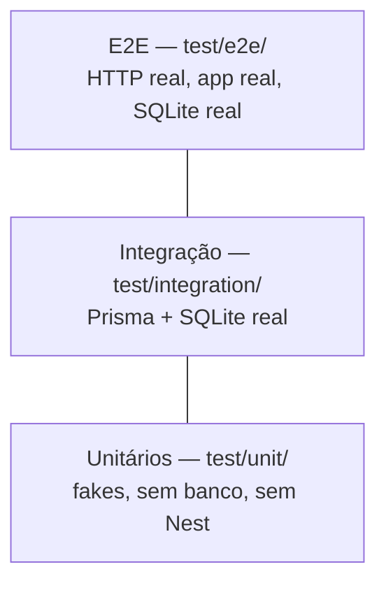

# Testes

## Pirâmide



| Nível | O que valida | O que é real | O que é fake |
| ----- | ------------ | ------------ | ------------ |
| Unitário | regras de autenticação | a classe sob teste | repositório, hasher, token |
| Integração | schema, constraints, mapeamento | Prisma + SQLite | nada |
| E2E | contrato HTTP completo | tudo | nada |

## Comandos

```bash
npm run test:unit          # rápido, roda a cada salvamento
npm run test:integration   # exige o banco de teste
npm run test:e2e           # sobe a aplicação inteira
npm test                   # unitários + integração
npm run test:cov           # os três, com cobertura
npm run test:watch         # unitários em watch mode
```

## O que é mockado e o que não é

**Mockado nos testes unitários** — [`test/helpers/fakes.ts`](../test/helpers/fakes.ts):

- `InMemoryUserRepository` implementa `UserRepository` com um `Map`
- `FakePasswordHasher` usa `hashed:<senha>`, previsível e instantâneo
- `FakeTokenService` devolve `token-for:<userId>` e registra as chamadas

Esses fakes são implementações honestas dos contratos, não `jest.mock()` sobre
módulos. É o Dependency Inversion pagando dividendo: as regras podem rodar sem
banco porque nunca dependeram de banco.

**Nunca mockado:**

- **Prisma nos testes de integração.** Mockar o ORM ali seria testar o mock. O
  valor do nível está justamente em verificar que a constraint `@unique`
  funciona e que `toDomain()` mapeia certo.
- **Argon2.** [`argon2-password-hasher.spec.ts`](../test/unit/argon2-password-hasher.spec.ts)
  usa o algoritmo real. É lento de propósito — é o que um hash de senha deve
  ser — daí o timeout estendido nessa suíte.
- **Nada no E2E.** A aplicação sobe com os mesmos pipes e filtros do
  `main.ts`.

**A única fronteira substituída:** os servidores do Google. Nenhum teste faz
chamada de rede para o OAuth. `GoogleAuthStrategy` é testada com perfis já
normalizados, que é exatamente o que o adaptador do Passport entregaria.

## Banco de teste

Desenvolvimento e teste usam arquivos diferentes:

```env
# .env        →  DATABASE_URL="file:./dev.db"
# .env.test   →  DATABASE_URL="file:./test.db"
```

[`test/setup/global-setup.ts`](../test/setup/global-setup.ts) roda uma vez, antes
das suítes de integração e E2E:

```
apaga prisma/test.db
        ↓
prisma db push  (recria o schema do zero num arquivo novo)
        ↓
cada suíte limpa a tabela no beforeEach / cria seu próprio fixture
        ↓
testes
```

Banco novo a cada execução é o que torna os testes determinísticos: eles não
herdam nada da rodada anterior nem do banco de desenvolvimento.

Integração e E2E rodam com `maxWorkers: 1`. SQLite é um arquivo único, e suítes
paralelas se atropelariam.

> Por que `db push` e não `migrate deploy`: `db push` aplica o schema
> diretamente, sem depender do histórico de migrations. Para o banco de teste,
> que é recriado sempre, é mais rápido e mais determinístico. As migrations
> continuam sendo a fonte de verdade para dev e produção.
>
> E por que o arquivo é apagado *antes* do `db push`, em vez de usar
> `--force-reset`: assim a operação é sempre uma criação, nunca um reset
> destrutivo. O banco de desenvolvimento não corre risco nem por engano.

## Cobertura

Configurada em [`jest.config.js`](../jest.config.js):

| Escopo | Linhas | Statements | Branches | Funções |
| ------ | ------ | ---------- | -------- | ------- |
| Projeto | 90% | 90% | 85% | 90% |
| `modules/auth/application/` | 100% | 100% | 100% | 100% |

O núcleo tem exigência maior porque é onde moram as regras. `main.ts`,
`swagger.ts` e os `*.module.ts` ficam fora da conta: são fiação, e testá-los
mediria configuração, não comportamento.

> **Sobre a meta.** 100% em todo o projeto incentivaria testes escritos para
> mover o número, não para verificar comportamento. Mais importante que a
> porcentagem é ter, para cada componente, os caminhos de **sucesso**,
> **entrada inválida**, **credencial inválida**, **dependência falhando** e
> **não autenticado**.

Relatório em HTML após `npm run test:cov`:

```
coverage/lcov-report/index.html
```

## Casos cobertos

### Unitários

`EmailPasswordAuthStrategy` — autenticação correta · usuário inexistente ·
senha incorreta · usuário sem senha local · normalização de e-mail · mensagem
idêntica para os dois tipos de falha.

`GoogleAuthStrategy` — usuário já vinculado · vínculo a conta local existente ·
criação no primeiro acesso · perfil sem `displayName` · perfil sem `googleId` ·
perfil sem e-mail.

`AuthService` — delega à Strategy certa · rejeita provider desconhecido ·
recusa duas Strategies para o mesmo provider · emite sessão · **não emite token
quando a autenticação falha**.

`Argon2PasswordHasher` — formato argon2id · salt aleatório · senha correta ·
senha incorreta · hash corrompido não derruba a requisição.

`JwtTokenService` — token verificável · tradução `sub` → `subject` · token
adulterado · token expirado.

Adaptadores — `LocalPassportStrategy` delega e propaga o erro sem traduzi-lo ·
`JwtPassportStrategy` recusa token de usuário removido · `GoogleAuthGuard`
responde 503 explicando qual variável falta.

`ApplicationErrorFilter` e `validateEnvironment` — todos os mapeamentos e todas
as regras de validação.

### Integração

`PrismaUserRepository` — busca por id, e-mail e `googleId` (com e sem
resultado) · criação via Google sem senha local · vínculo preservando a senha
existente · unicidade de e-mail · unicidade de `googleId` · mapeamento para a
entidade de domínio.

### E2E

`POST /auth/login` — 200 com credenciais válidas · formato completo da resposta
· hash nunca vaza · 401 com senha errada · 401 com usuário inexistente ·
respostas idênticas nos dois casos · 400 para corpo vazio, e-mail inválido,
senha curta e campo desconhecido · e-mail com maiúsculas e espaços.

`GET /auth/me` — 401 sem token, com token inválido e com esquema errado · 200
com token válido · 401 quando o usuário foi removido do banco.

`POST /auth/logout` — 401 sem autenticação · 204 autenticado · **o token
continua válido depois** (limitação documentada, não bug).

## Definition of done

```bash
npm run lint:check
npm test
npm run test:e2e
npm run test:cov
npm run docs:lint
```
